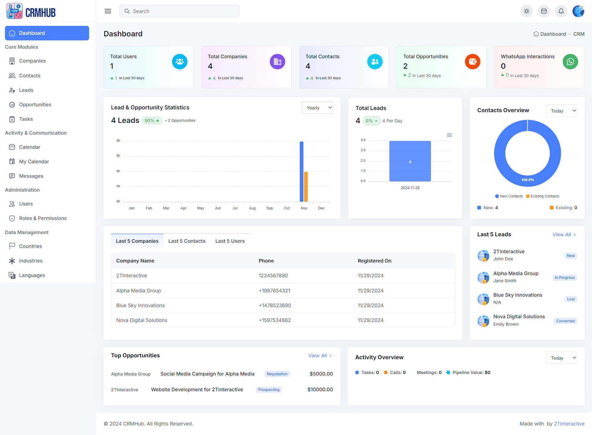
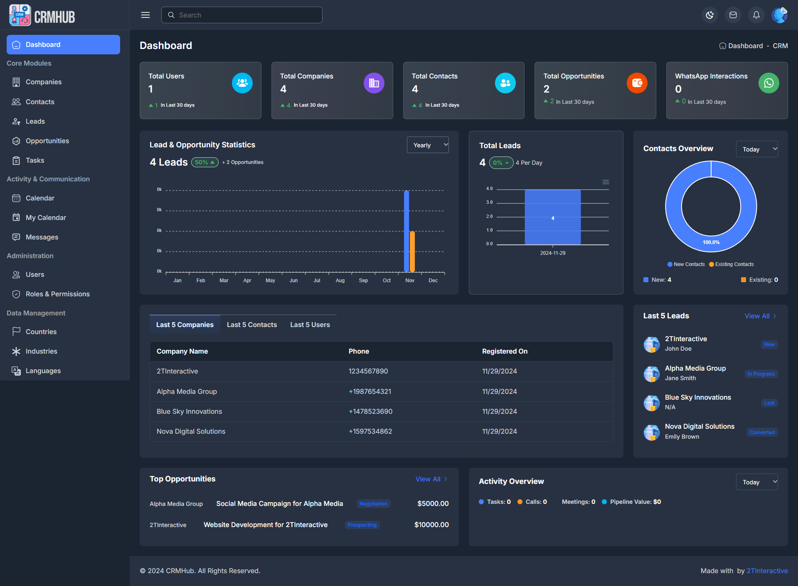
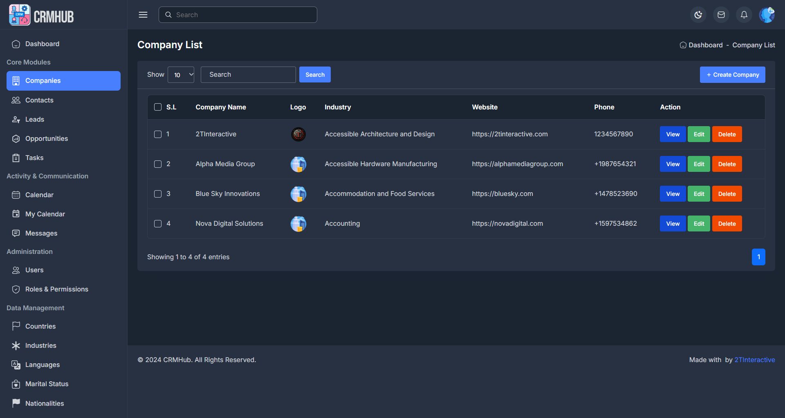
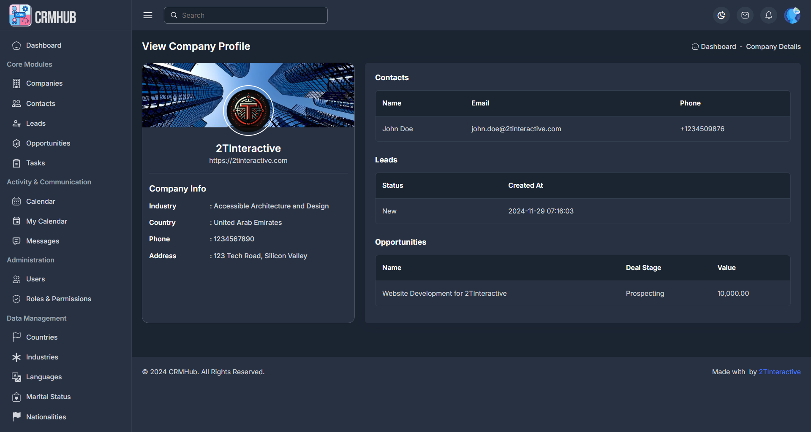
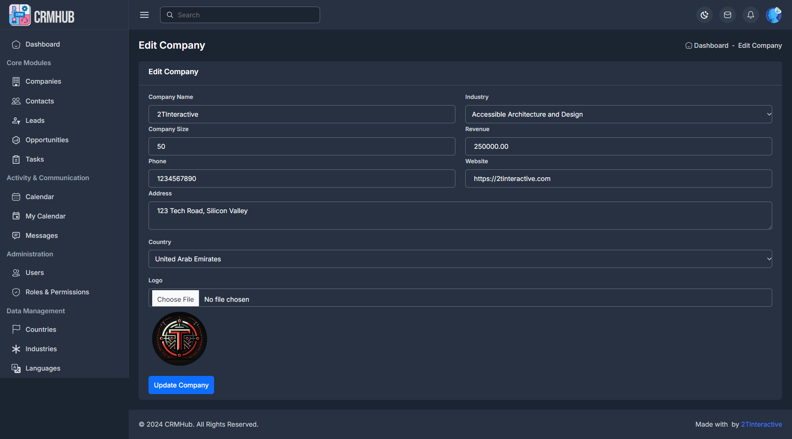
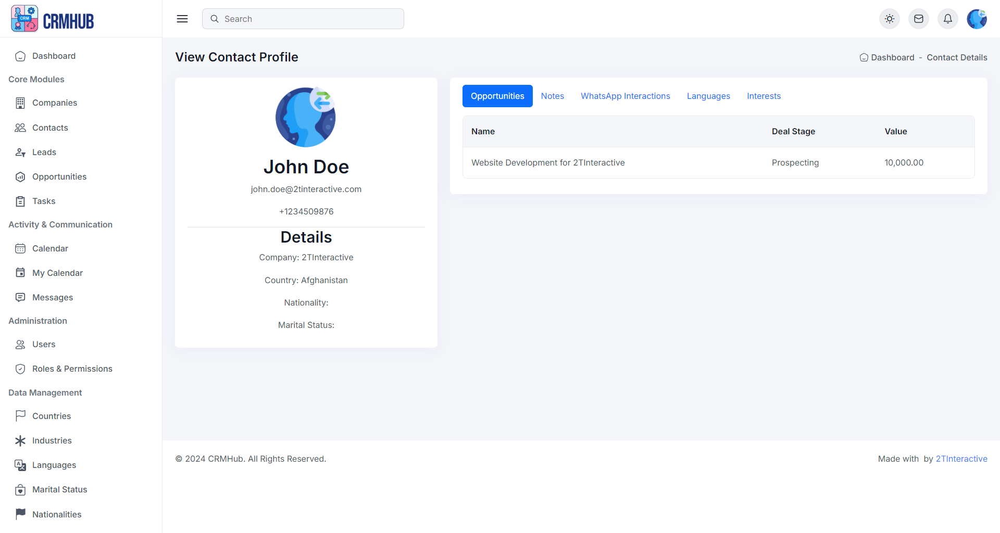
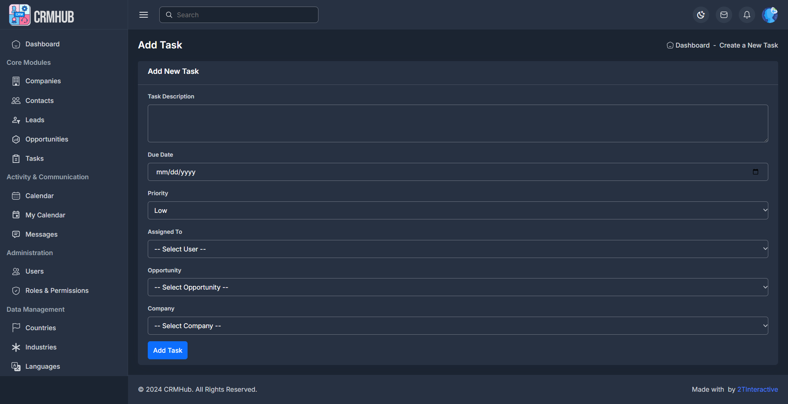

# CRMHub

CRMHub is a dynamic and modular **Customer Relationship Management (CRM)** solution tailored for businesses of all sizes. Designed to improve operational efficiency, CRMHub offers a wide range of features, including user role management, task tracking, calendar integrations, messaging systems, and comprehensive data analytics.

---

## 🔑 Key Features
### User Management
- Create, edit, and manage user accounts.
- Assign roles dynamically with a hierarchical permission structure.
- Manage user avatars and profile details.

### Role-Based Access Control (RBAC)
- Secure access with customizable roles (e.g., Admin, Manager, Employee, Client).
- Assign multiple roles to a single user via a user-role management system.

### Task Management
- Create, prioritize, and manage tasks with status updates (Pending, In Progress, Completed, Overdue).
- Assign tasks to specific users and link them to opportunities, companies, or contacts.
- Monitor deadlines with due dates.

### Calendar Integration
- View and manage personal events using the FullCalendar library.
- Filter events by user or category for efficient scheduling.
- Access shared organizational calendars for collaboration.

### Messaging and Interaction Logging
- Integrated WhatsApp messaging for seamless communication.
- Log message details, ensuring a record of client interactions.
- Retrieve interaction history directly in user and contact profiles.

### Reports and Analytics
- Generate insights on tasks, events, and user activity.
- Monitor business operations and customer engagement trends.
- Export reports for offline analysis.

---

---

## 🚀 Getting Started

### Prerequisites
- **PHP**: 8.x or later.
- **MySQL**: 5.7 or later.
- **Apache/Nginx**: Ensure mod_rewrite is enabled.
- **Composer**: For dependency management.

## 🛠 Configuration

- **Roles and Permissions**
- Predefined roles include:
- Admin: Full access to all modules.
- Manager: Can manage teams, tasks, and calendars.
- Employee: Limited task management and profile editing.
- Client: Restricted to personal data and assigned tasks.

Extend roles via the roles table in the database.

**Environment Variables**
Use .env to configure sensitive settings such as API keys for third-party integrations like WhatsApp or Google Calendar.

## 📜 License
This software is proprietary.
Contact 2TInteractive for licensing, pricing, and customization.

## 🛡️ Security
All passwords are hashed using password_hash() for enhanced security.
Role-based access ensures granular control over sensitive data.

